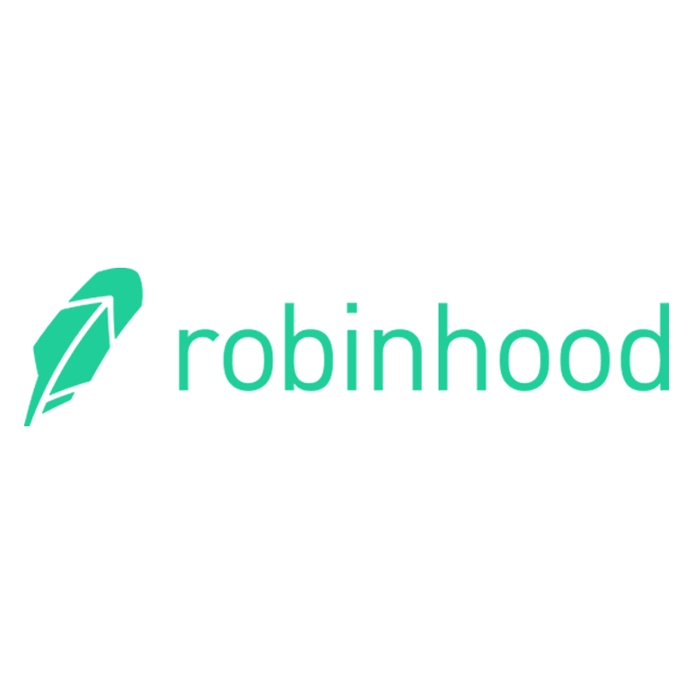

# FinTech Bootcamp 03.14.2020 Case Study

## RobinHood Case Study
Robinhood is a stock trading platform driven by no-cost trading and an accessible mobile platform. 

Contributors: Robert Benton

### Case Study Report
Robinhood Company Background:
Robinhood is both an introducing and clearing broker with a mobile facing stock trading platform with a primary customer target of millenials. Robinhood disrupted the industry with free trading, causing many of the bigger firms to follow suit. Instead of commissions, Robinhood generates revenues based on margin fees and loaning of client securities and cash. 

Robinhood's ability to use technology to reduce the human capital requirements of stock trading has allowed them to scale extremely quickly, while maintaining a relatively low number of employees to handle the volume. To date, they employ around 250 people. Robinhood is considered a Fintech company because they directly work within the stock market trading sector. 

This company has excelled in the space by pioneering the no-commission trading platform and supplementing that with easy to use mobile technology. Their strengths are cost-appeal and easy-to-use technology, along with zero account minimums. Their weaknesses compared to other brokers are lack of research and other resources for their investors, along with recent weaknesses in the stability of their platform. 

In the future, Robinhood plans to enter traditional banking by offering above-average returns on cash in checking accounts along with other traditional finance needs. If Robinhood continues to innovate new ways to generate revenue while passing along cost savings to customers, they will continue to grow. 